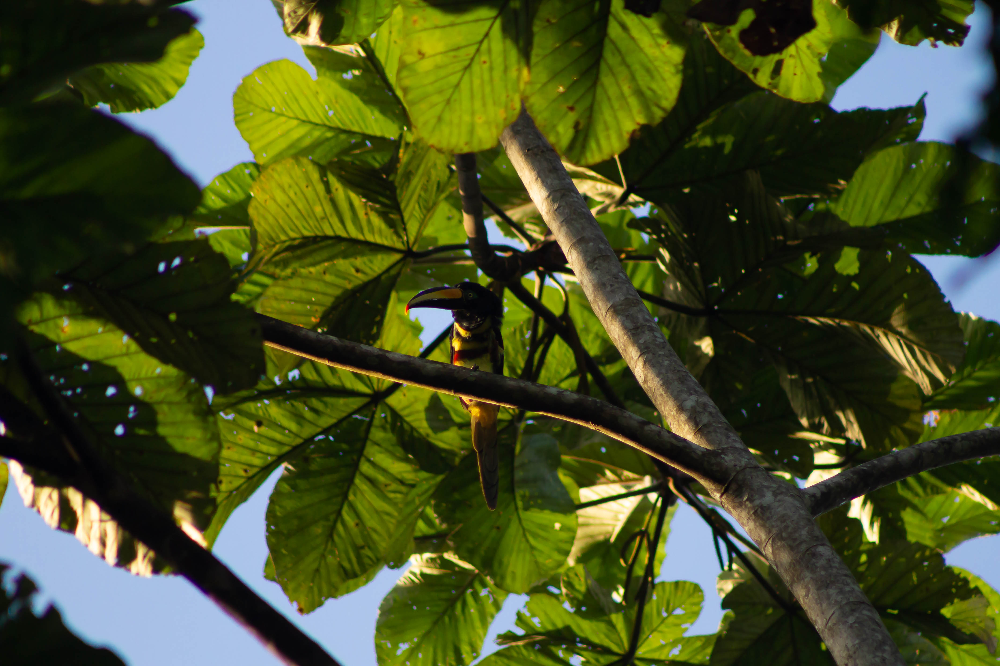

# Yasuní 2022

### Summer 2022 in Parque Nacional Yasuní, Ecuador

I studied leaf rolling as a defense against herbivory. I quantified standing herbivory and created an experiment, manipulating leaves to be rolled or unrolled.

Thank you to Emilio Trujillo for this photo. 

### This repo contains

-   raw data files
-   R code to analyze data

### Dependencies

-   tidyverse
-   lme4
